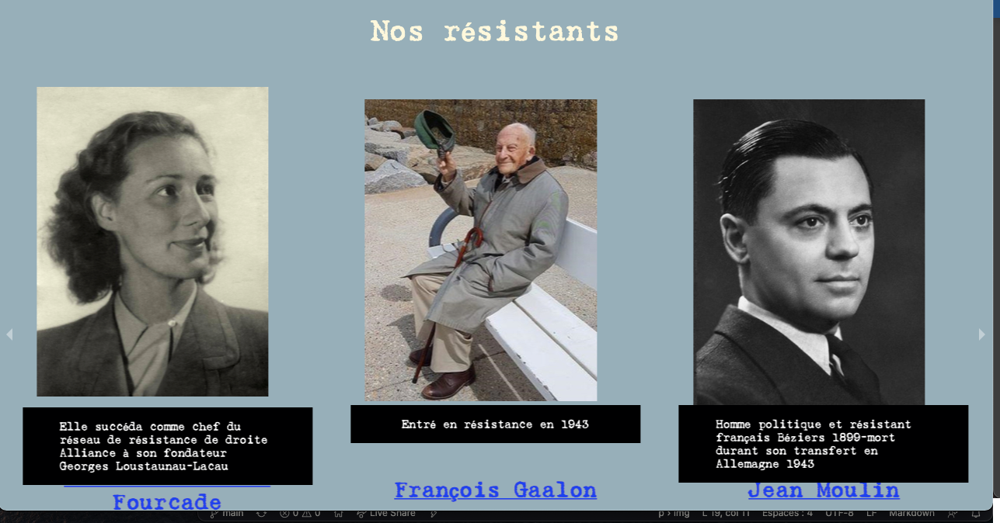

# Getting Started 

Se projet a ete fait pendant le hackathon de la wild code school
donc 48 heures de codes non stop 

R&aliser avec 3 autres de mes camarades
a qui je dit bravo car cela a etait tres dure de pas beaucoup dormir durant se challenge

vous pouvez telechager le repo et le lancer en faisant 

### `npm start`

le mot de pass et debarquement mais vous pouvez aussi écouter le General de Gaulle a la RTBF 

Amuser vous bien avec se code 

### Lien vers la démo héberger sur Netlify
URL : [https://les-resistants.netlify.app] (https://les-resistants.netlify.app)

